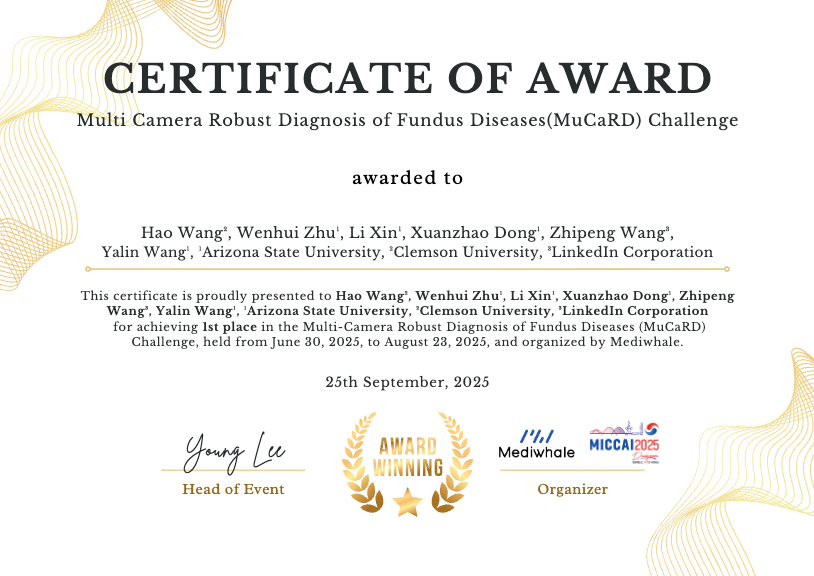
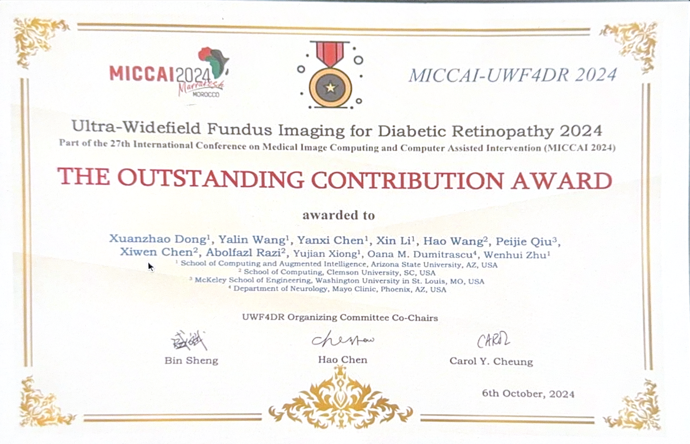
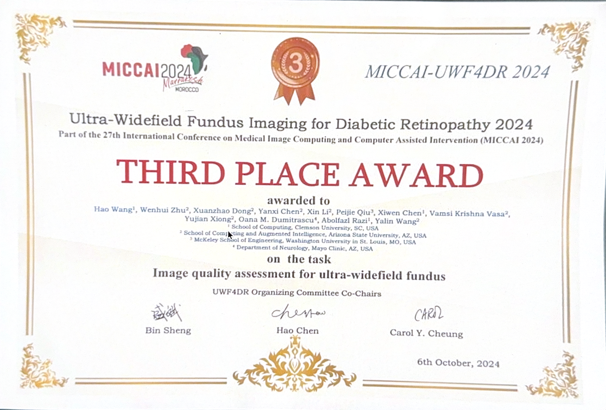
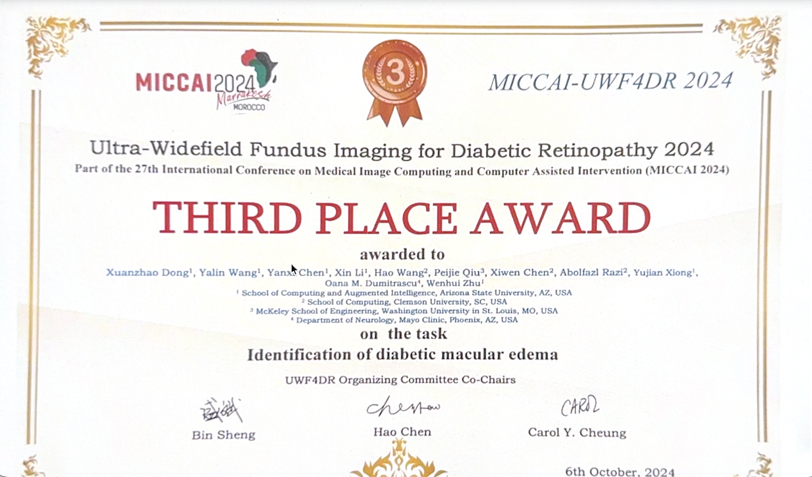

# NNMOBILE-NET 

Code for the paper [nnMobileNet: Rethinking CNN for Retinopathy Research](https://openaccess.thecvf.com/content/CVPR2024W/DCAMI/papers/Zhu_nnMobileNet_Rethinking_CNN_for_Retinopathy_Research_CVPRW_2024_paper.pdf)

## This repository will be maintained and updated! Stay Tuned!
We will appreciate any suggestions and comments. If you find this code helpful, please cite our papers. Thanks! 
```
@inproceedings{zhu2024nnmobilenet,
  title={nnMobileNet: Rethinking CNN for Retinopathy Research},
  author={Zhu, Wenhui and Qiu, Peijie and Chen, Xiwen and Li, Xin and Lepore, Natasha and Dumitrascu, Oana M and Wang, Yalin},
  booktitle={Proceedings of the IEEE/CVF Conference on Computer Vision and Pattern Recognition},
  pages={2285--2294},
  year={2024}
}
```
##
**Abstract** 
Over the past few decades, convolutional neural networks (CNNs) have been at the forefront of the detection and tracking of various retinal diseases (RD). Despite their success, the emergence of vision transformers (ViT) in the 2020s has shifted the trajectory of RD model development. The leading-edge performance of ViT-based models in RD can be largely credited to their scalability—their ability to improve as more parameters are added. As a result, ViT-based models tend to outshine traditional CNNs in RD applications, albeit at the cost of increased data and computational demands. ViTs also differ from CNNs in their approach to processing images, working with patches rather than local regions, which can complicate the precise identification of small, variably presented lesions in RD. In our study, we revisited and updated the architecture of a CNN model, specifically MobileNet, to enhance its utility in RD diagnostics. We found that an optimized MobileNet, through selective modifications, can surpass ViT-based models in various RD benchmarks, including diabetic retinopathy grading, detection of multiple fundus diseases, and classification of diabetic macular edema. 


## Experiments


We also brought this model to [MICCAI MMAC 2023](https://codalab.lisn.upsaclay.fr/competitions/12477), and won the 3rd.


```
---------------------------------------------------------------------------------------------
In main.py -> ImageNet pretrained weight 
    model = ReXNetV1(width_mult=3.0,classes=args.nb_classes,dropout_path=args.drop_path)
    model.load_state_dict(torch.load('rexnet_3.0.pth'),strict=False)
---------------------------------------------------------------------------------------------
```
rexnet_3.0.pth download from [Google Drive](https://drive.google.com/file/d/1COB7eKY4VAS9QOnpBLTg4wxW27U3RFSy/view?usp=sharing) Or [Rexnet Official repo](https://github.com/clovaai/rexnet)  

Single-GPU 
```
python main.py  --input_size 224 --drop_path 0.2 

```

Multi-GPU
```
python -m torch.distributed.launch --nproc_per_node=4 main.py --batch_size 24 --lr 1e-3 --update_freq 1 --weight_decay 0.005 --min_lr 1e-6 --input_size 512 --drop_path 0.21 --data_set MICCAI --nb_classes 5 --warmup_epochs 20 --epochs 1000 --main_eval avarage --cutmix 1.0 --opt adamp --mixup 0.8 --log_dir Experiment/size_512_dp_0.21_DataArg_True/fold_5/log --output_dir Experiment/size_512_dp_0.21_DataArg_True/fold_5 --fold_train kfold_csv/train_fold_5.csv --fold_test kfold_csv/test_fold_5.csv
```


## 🏆 Competitions and Awards

- **MICCAI 2025 – Multi-Camera Robust Diagnosis of Fundus Diseases (MuCaRD) Challenge**

  *Held from June 30 to August 30, 2025 — organized by Mediwhale and MICCAI Society*

  🥇 **Top-Ranked Team**




- **MICCAI 2024 – Ultra-Widefield Fundus Imaging for Diabetic Retinopathy (UWF-4DR) Challenge**

  *27th International Conference on Medical Image Computing and Computer-Assisted Intervention (MICCAI 2024)*

  - 🏅**Outstanding Contribution Award**
  - 🥉 **Third Place – Image Quality Assessment for Ultra-Widefield Fundus**
  - 🥉 **Third Place – Identification of Diabetic Macular Edema**

  







  ## License

  Released under the [ASU GitHub Project License](https://github.com/Retinotopy-mapping-Research/DRRM/blob/master/LICENSE.txt).
