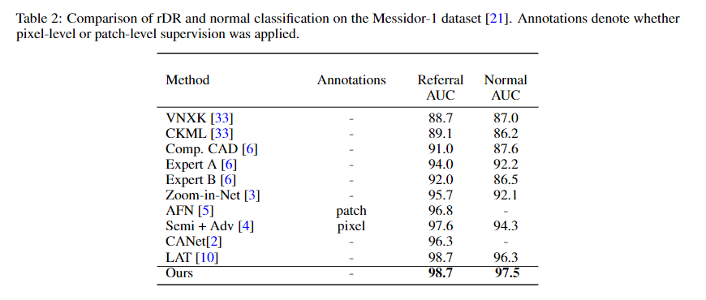
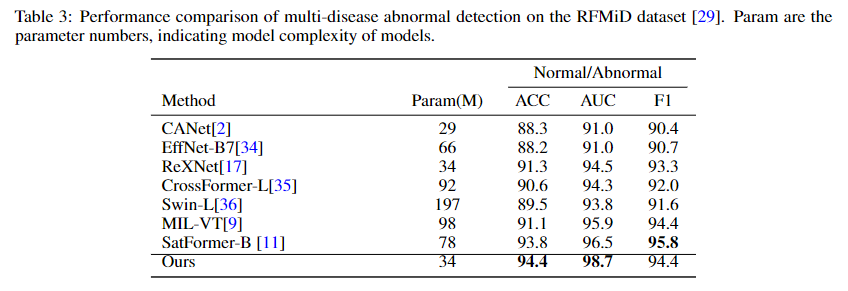
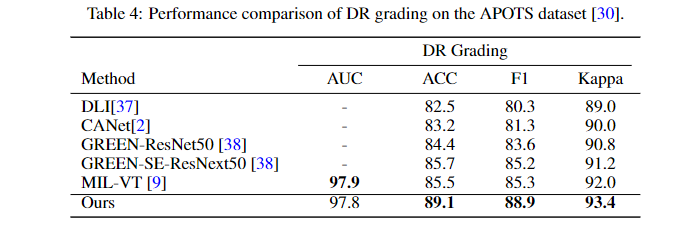
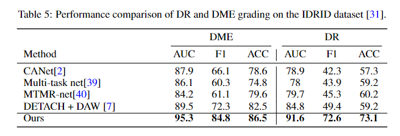
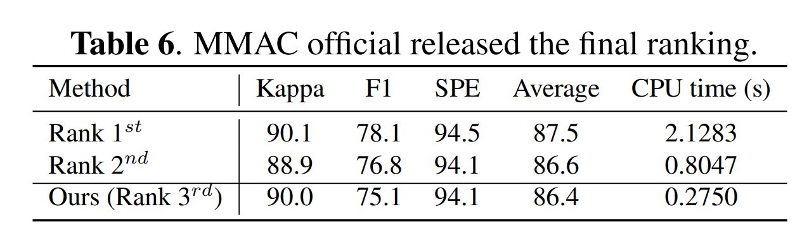

# NNMOBILE-NET 

Code for the paper [nnMobileNe: Rethinking CNN for Retinopathy Research](https://arxiv.org/abs/2306.01289)


**Abstract** 
Over the past few decades, convolutional neural networks (CNNs) have been at the forefront of the detection and tracking of various retinal diseases (RD). Despite their success, the emergence of vision transformers (ViT) in the 2020s has shifted the trajectory of RD model development. The leading-edge performance of ViT-based models in RD can be largely credited to their scalability—their ability to improve as more parameters are added. As a result, ViT-based models tend to outshine traditional CNNs in RD applications, albeit at the cost of increased data and computational demands. ViTs also differ from CNNs in their approach to processing images, working with patches rather than local regions, which can complicate the precise identification of small, variably presented lesions in RD. In our study, we revisited and updated the architecture of a CNN model, specifically MobileNet, to enhance its utility in RD diagnostics. We found that an optimized MobileNet, through selective modifications, can surpass ViT-based models in various RD benchmarks, including diabetic retinopathy grading, detection of multiple fundus diseases, and classification of diabetic macular edema. 


## Experiments









We also brought this model to [MICCAI MMAC 2023](https://codalab.lisn.upsaclay.fr/competitions/12477), and won the 3rd.



### This repository will be maintained and updated! Stay Tuned!
We will appreciate any suggestions and comments. If you find this code helpful, please cite our papers. Thanks! 
```
@article{zhu2023nnmobile,
  title={NNMobile-Net: Rethinking CNN Design for Deep Learning-Based Retinopathy Research},
  author={Zhu, Wenhui and Qiu, Peijie and Lepore, Natasha and Dumitrascu, Oana M and Wang, Yalin},
  journal={arXiv preprint arXiv:2306.01289},
  year={2023}
} 
```

  ## License

  Released under the [ASU GitHub Project License](https://github.com/Retinotopy-mapping-Research/DRRM/blob/master/LICENSE.txt).
